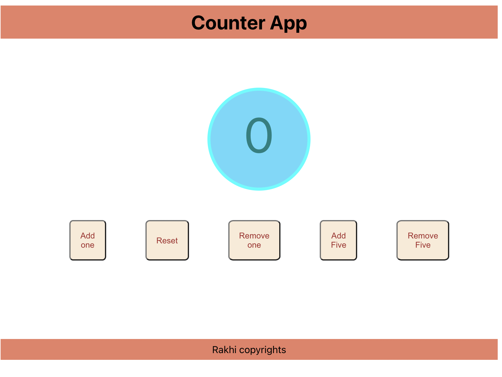

# Counter App using React
- This is an application to understand how state can be initialised and setstate can be used to change value of state.
- We have 5 buttons add one,add five,remove one,remove five and reset
- initially the counter value is zero.
- clicking on add one the counter value is incremented by one, clicking on add five counter value is incremented by five,clicking on remove one the counter value is decremented by one,clicking on remove five the counter value is decremented by five
- by clicking on reset button the counter value reset to initial value zero.
##

